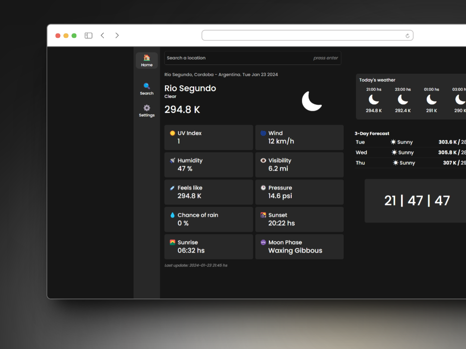
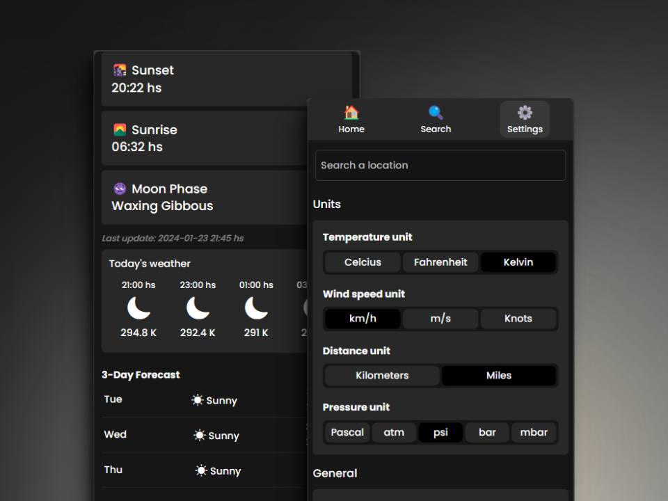

# Weather App 🌥️

This project shows you the current weather at your location, a forecast for the next 3 days and what the weather will be like in the next few hours. It allows you to search for other locations and see their details, as well as to configure the units of the displayed values such as temperature, distances, pressure, etc.

website link : https://weather-app-puchinn.vercel.app/

### Technologies:

- [React](https://react.dev/)
- [React Router](https://reactrouter.com/en/main)
- [Redux Toolkit](https://redux-toolkit.js.org/)
- [TailwindCSS](https://tailwindcss.com/)

### Data

- [Weather Api](https://www.weatherapi.com/)

### Screenshots

